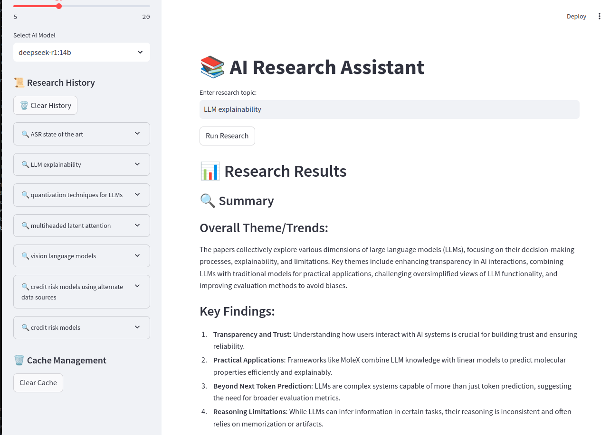

# AI Research Assistant

This project uses Arxiv to obtain research papers based on a user's input and creates a summary using an LLM served through Ollama.

## Screenshot



The app features:
- 📝 Topic-based research paper search
- 🤖 AI-powered paper summarization
- 📚 Detailed paper listings with abstracts
- 📥 PDF report export
- 💾 Search history and caching
- ⚙️ Configurable paper count and AI model selection

## Getting Started

```
pip install requirements.txt
streamlit run streamlit_simple_app.py
```

## Bonus (CrewAI app)

```
streamlit run streamlit_app.py
```

Note: The CrewAI agent that does arxiv research gives strange summaries at times from ollama.

Disclaimer: Co-written with Cursor

